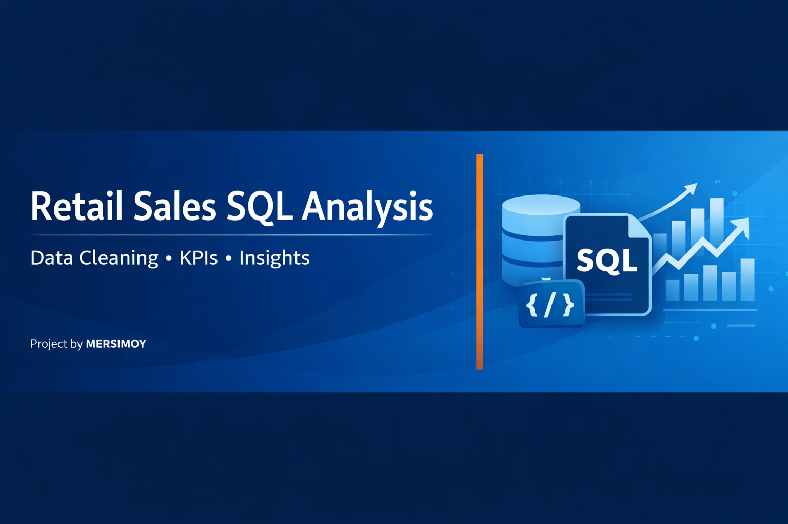

Retail Sales SQL Analysis
Author: MERSIMOY GURMU
Tools Used: MySQL Workbench, SQL

================Project Overview===============
This project analyzes a retail sales dataset using SQL.
It walks through a complete, real‑world data analytics workflow:
    -Loading and inspecting raw data
    -Cleaning and standardizing inconsistent values
    -Fixing duplicates, date formats, and incorrect totals
    -Performing KPI calculations
    -Generating insights for business decision‑making

The goal of this project is to demonstrate practical SQL skills used in data analytics roles, including data cleaning, transformation, aggregation, and interpretation.

===============Dataset Description===================
The dataset contains retail transaction records with the following fields:
       - Order_ID – Unique identifier for each order
       - Order_Date – Date of the transaction
       - Customer_ID – Unique customer identifier
       - Product – Product purchased
       - Category – Product category
       - Region – Geographic region of the sale
       - Quantity – Number of units sold
       - Unit_Price – Price per unit
       - Total_Price – Total amount paid
       - Payment_Method – Payment type used

===================Data Cleaning Steps==================
The raw dataset contained several issues that needed correction before analysis.
Below are the cleaning steps performed:

1. Removed Duplicate Rows
       - Identified duplicate Order_ID values
       - Added a temporary auto‑increment column
       - Kept the earliest row and deleted the rest
       - Dropped the temporary column

2. Standardized Region Names
       - Converted inconsistent region values (e.g., “west”, “WEST”) into proper case (“West”)

3. Fixed Mixed Date Formats
       - Original dataset contained both YYYY-MM-DD and YYYY/MM/DD
       - Converted all values into a clean DATE column
       - Dropped the messy column and renamed the clean one

4. Corrected Incorrect Totals
        - Recalculated Total_Price using Quantity × Unit_Price
        - Updated all mismatched rows

5. Checked for Missing Values
       - Verified that no critical fields contained NULL values
       - The dataset is now clean, consistent, and ready for analysis.

==================Full SQL Script=========================
The complete SQL cleaning and analysis script is available here:

        /sql/retail_sales_analysis.sql

Key Performance Indicators (KPIs)
--------------------------------------------------------------
KPI                           	Value
--------------------------------------------------------------
Total Revenue                   $9,387.62
Total Orders	                46
Average Order Value (AOV)   	$204.08
Total Units Sold	            276
--------------------------------------------------------------

====================Revenue Breakdown=======================
By Category
    Electronics: $6,915.74
    Furniture: $2,149.88
    Stationery: $322.00

By Region
    South: $3,797.39
    East: $2,599.92
    West: $1,955.89
    North: $1,034.42

========================Insights & Findings===========================
1. Electronics dominate revenue
Electronics contribute 74% of total revenue, making them the strongest category.
This category should remain a priority for inventory planning and marketing.

2. The South region is the top-performing market
The South generates 40% of total revenue, outperforming all other regions.
This suggests strong customer demand and brand presence in that area.

3. The North region underperforms
With only $1,034.42 in revenue, the North shows the weakest performance.
This may indicate low brand awareness or limited distribution.

4. High Average Order Value ($204.08)
Customers spend over $200 per order, which is relatively high for retail.
This suggests strong purchasing behavior and potential for upselling.

5. Furniture shows steady demand
Furniture contributes $2,149.88, making it a solid secondary category.

6. Stationery has low revenue
Stationery contributes only $322, indicating low profitability.
The business may consider reducing inventory or bundling these items.

======================Project Structure======================
retail-sales-sql-analysis/
│
├── sql/
│   └── retail_sales_analysis.sql
│
├── data/
│   └── retail_sales.csv   (optional)
│
└── README.md

=====================How to Run This Project=====================
Import the dataset into MySQL
Open the SQL script in /sql/retail_sales_analysis.sql
Run the cleaning section
Run the KPI and analysis queries
Review the insights